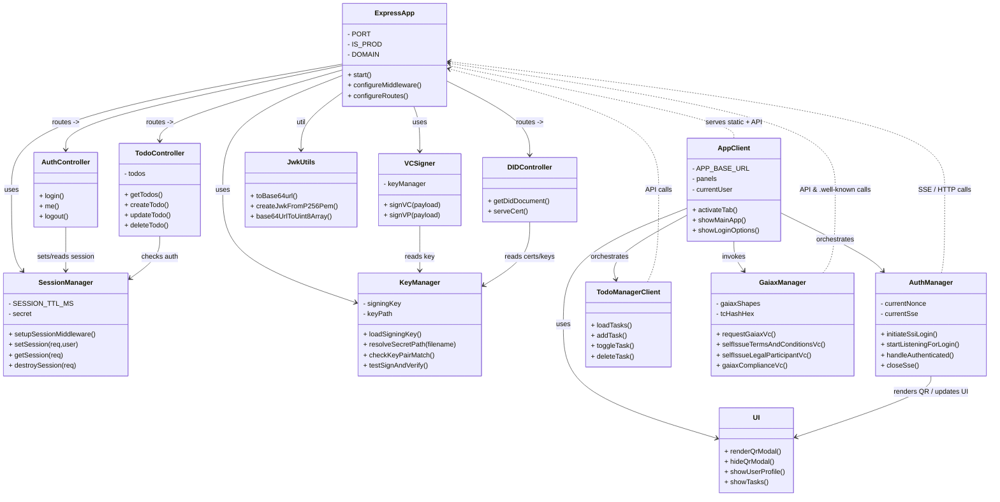

# Family Organizer

Minimal web app for shared ToDo management with SSI (Self-Sovereign Identity) and GAIA‑X onboarding helpers.

## Quick start

1. Install dependencies:
   ```sh
   npm install
   ```
2. Run the server:
   ```sh
   npm start
   ```
3. Open the app in a browser:
   - Production default: https://family-organizer.onrender.com
   - Local dev: http://localhost:3000

## Project layout (important files)

- [server.js](server.js) — Express server, session handling, VC signing and DID doc endpoints.
  - Key symbol: [`isAuthenticated`](server.js)
  - Key symbol: [`testSignAndVerify`](server.js)
- [oldserver.js](oldserver.js) — legacy DID doc generation and utilities (kept for reference).
  - Key symbol: [`createJwkFromP256Pem`](oldserver.js)
- [old_jwk_server.js](old_jwk_server.js) — alternative server implementation (kept for reference).
  - Key symbol: [`isAuthenticated`](old_jwk_server.js)
- public/ — client assets served statically
  - [public/index.html](public/index.html) — SPA markup and UI placeholders (QR modal, GAIA‑X steps).
  - [public/styles.css](public/styles.css) — main styles.
  - [public/old_styles.css](public/old_styles.css) — legacy styles.
  - [public/didDoc.js](public/didDoc.js) — client helper: [`generateDidDoc`](public/didDoc.js)
  - [public/legal_participant_index.js](public/legal_participant_index.js) — main client logic:
    - Login & session helpers: [`handlePostLogin`](public/legal_participant_index.js), [`checkExistingSession`](public/legal_participant_index.js)
    - Google Sign-In handler: [`window.onSignIn`](public/index.html) (wired from GSI)
    - SSI wallet flow: [`initiateSsiLogin`](public/legal_participant_index.js), [`startListeningForLogin`](public/legal_participant_index.js), [`handleAuthenticated`](public/legal_participant_index.js)
    - GAIA‑X flows: [`requestGaiaxVc`](public/legal_participant_index.js), [`selfIssueTermsAndConditionsVc`](public/legal_participant_index.js), [`selfIssueLegalParticipantVc`](public/legal_participant_index.js), [`gaiaxComplianceVc`](public/legal_participant_index.js)
  - [public/.well-known/](public/.well-known/) — DID / cert material served for DID resolution and x5u references (e.g., `fullpem/0001_chain.pem`, `cert/0000_cert.pem`).

## Features

- ToDo list with backend persistence and session-based auth (protected routes use [`isAuthenticated`](server.js) middleware).
- Google Sign-In integration (GSI) and SSI Wallet login via QR + SSE (`initiateSsiLogin`, `startListeningForLogin`).
<!-- - Dynamic DID document generation and JWK/x5u supopenapi: 3.0.3
info:
  title: Family Organizer API
  version: 1.0.0
  description: |
    OpenAPI description for the endpoints implemented/served by server.js in the
    family-organizer project (session, DID/.well-known assets, VC signing, todos).
servers:
  - url: https://family-organizer.onrender.com
    description: Production
  - url: http://localhost:3000
    description: Local development

components:
  securitySchemes:
    cookieAuth:
      type: apiKey
      in: cookie
      name: fo_session
    bearerAuth:
      type: http
      scheme: bearer
      bearerFormat: JWT

  schemas:
    User:
      type: object
      properties:
        id:
          type: string
        email:
          type: string
          format: email
        name:
          type: string
        picture:
          type: string
          format: uri
    SessionInfo:
      type: object
      properties:
        authenticated:
          type: boolean
        user:
          $ref: '#/components/schemas/User'
    LoginRequest:
      type: object
      properties:
        provider:
          type: string
          description: "e.g. 'google' or 'ssi'"
        idToken:
          type: string
          description: "Provider token (if using GSI)."
      required:
        - provider
    Todo:
      type: object
      properties:
        id:
          type: string
        title:
          type: string
        completed:
          type: boolean
        createdAt:
          type: string
          format: date-time
    Todos:
      type: array
      items:
        $ref: '#/components/schemas/Todo'
    VCSignRequest:
      type: object
      properties:
        payload:
          type: object
          description: "VC payload to be signed (claim content)."
        options:
          type: object
          description: "Optional signing options (kid, typ, alg, etc.)."
    SignedJwt:
      type: object
      properties:
        jwt:
          type: string
          description: "Compact JWS/JWT signed by server key."
    DIDDocument:
      type: object
      description: "Did document JSON served at /.well-known/did.json"

paths:
  /api/session/login:
    post:
      summary: Sign-in / create session
      description: Accepts provider login tokens or server-side login payload and creates a server session cookie.
      requestBody:
        content:
          application/json:
            schema:
              $ref: '#/components/schemas/LoginRequest'
      responses:
        '200':
          description: Session created
          content:
            application/json:
              schema:
                $ref: '#/components/schemas/SessionInfo'
        '400':
          description: Invalid request
  /api/session/me:
    get:
      summary: Get current session info
      description: Returns session/authenticated user info if a valid session cookie is present.
      security:
        - cookieAuth: []
      responses:
        '200':
          description: Current session
          content:
            application/json:
              schema:
                $ref: '#/components/schemas/SessionInfo'
        '401':
          description: Not authenticated
  /api/session/logout:
    post:
      summary: Logout / destroy session
      description: Clears server session and cookie.
      security:
        - cookieAuth: []
      responses:
        '200':
          description: Logged out

  /api/todos:
    get:
      summary: List todos
      description: Returns all todos for the authenticated session.
      security:
        - cookieAuth: []
      responses:
        '200':
          description: List of todos
          content:
            application/json:
              schema:
                $ref: '#/components/schemas/Todos'
        '401':
          description: Not authenticated
    post:
      summary: Create todo
      description: Create a new todo for the authenticated user.
      security:
        - cookieAuth: []
      requestBody:
        required: true
        content:
          application/json:
            schema:
              type: object
              properties:
                title:
                  type: string
      responses:
        '201':
          description: Created
          content:
            application/json:
              schema:
                $ref: '#/components/schemas/Todo'
        '400':
          description: Bad request
        '401':
          description: Not authenticated

  /api/todos/{id}:
    parameters:
      - name: id
        in: path
        required: true
        schema:
          type: string
    put:
      summary: Update todo
      description: Update todo fields (title/completed).
      security:
        - cookieAuth: []
      requestBody:
        required: true
        content:
          application/json:
            schema:
              type: object
              properties:
                title:
                  type: string
                completed:
                  type: boolean
      responses:
        '200':
          description: Updated todo
          content:
            application/json:
              schema:
                $ref: '#/components/schemas/Todo'
        '401':
          description: Not authenticated
        '404':
          description: Not found
    delete:
      summary: Delete todo
      description: Remove a todo by id.
      security:
        - cookieAuth: []
      responses:
        '204':
          description: Deleted
        '401':
          description: Not authenticated
        '404':
          description: Not found

  /.well-known/did.json:
    get:
      summary: DID Document
      description: Serves the DID Document (did:web) for this service.
      responses:
        '200':
          description: DID document
          content:
            application/json:
              schema:
                $ref: '#/components/schemas/DIDDocument'
  /.well-known/fullpem/{file}:
    get:
      summary: Serve PEM chain
      description: Serve PEM chain files referenced by DID/x5u entries.
      parameters:
        - name: file
          in: path
          required: true
          schema:
            type: string
      responses:
        '200':
          description: PEM file (text)
          content:
            application/x-pem-file:
              schema:
                type: string
  /.well-known/cert/{file}:
    get:
      summary: Serve certificate files
      description: Serve certificate files used by DID/x5u references.
      parameters:
        - name: file
          in: path
          required: true
          schema:
            type: string
      responses:
        '200':
          description: PEM certificate (text)
          content:
            application/x-pem-file:
              schema:
                type: string

  /.well-known/gaia-x/tc/tc.txt:
    get:
      summary: Terms & Conditions (text)
      description: Static T&C text used by GAIA-X flows.
      responses:
        '200':
          description: T&C text
          content:
            text/plain:
              schema:
                type: string

  /api/sign-vc:
    post:
      summary: Sign a Verifiable Credential (VC)
      description: Server-side VC signing endpoint. Expects a VC payload and returns a signed JWT / JWS.
      security:
        - cookieAuth: []
      requestBody:
        required: true
        content:
          application/json:
            schema:
              $ref: '#/components/schemas/VCSignRequest'
      responses:
        '200':
          description: Signed VC (JWT)
          content:
            application/json:
              schema:
                $ref: '#/components/schemas/SignedJwt'
        '401':
          description: Not authenticated
        '400':
          description: Bad request
  /api/sign-vp:
    post:
      summary: Sign a Verifiable Presentation (VP)
      description: Server-side VP signing endpoint.
      security:
        - cookieAuth: []
      requestBody:
        required: true
        content:
          application/json:
            schema:
              $ref: '#/components/schemas/VCSignRequest'
      responses:
        '200':
          description: Signed VP (JWT)
          content:
            application/json:
              schema:
                $ref: '#/components/schemas/SignedJwt'
        '401':
          description: Not authenticated

tags:
  - name: session
    description: Session and authentication endpoints
  - name: todos
    description: ToDo CRUD
  - name: did
    description: DID and .well-known resources
  - name: vc
    description: Verifiable Credential/Presentation signing

externalDocs:
  description: Project repository
  url: https://github.com/your-repo/family-organizerport on the server (`createJwkFromP256Pem` in legacy server; current logic in [server.js](server.js)). -->
- GAIA‑X onboarding helpers: request Legal Registration VC, self-issue T&C and Participant VCs, then request Compliance VC (client flows in [public/legal_participant_index.js](public/legal_participant_index.js)).
- Service worker for offline caching: [public/sw.js](public/sw.js).

## Running & testing notes

- Sessions/cookies: server stores session and exposes `/api/session/login`, `/api/session/me`, `/api/session/logout`. Client calls `/api/session/login` via [`handlePostLogin`](public/legal_participant_index.js).
- DID resolution: the app serves a DID doc at `/.well-known/did.json` generated by server code in [server.js](server.js) (or legacy [oldserver.js](oldserver.js) / [old_jwk_server.js](old_jwk_server.js) for reference).
- VC signing: server uses `jose` (see [`testSignAndVerify`](server.js)) and endpoints `/api/sign-vc` and `/api/sign-vp`.
- If testing SSI flows that rely on SSE, ensure your environment allows EventSource connections to the configured issuer agent (`initiateSsiLogin` uses an external auth agent URL by default in the client code).

## Development tips

- Change `APP_BASE_URL` in [public/legal_participant_index.js](public/legal_participant_index.js) when running locally.
- Static certs and PEM chains live under `public/.well-known/fullpem` and `public/.well-known/cert`. The server references them when generating DID documents.
- Debug logs for client flows are written into the in-page debug panel (`#ssiDebug`) in [public/old_styles.css](public/old_styles.css) / [public/styles.css](public/styles.css) affects visibility.

## Class Diagram


## Security & deployment

- .etc/secrets/ contains private keys and is excluded in `.gitignore`. Do not commit secrets.
- In production, ensure `NODE_ENV=production` and server sets secure cookie flags (`secure: true`, `sameSite: 'none'`) as controlled in [server.js](server.js) and [old_jwk_server.js](old_jwk_server.js).
- When deploying DID/x5u material, ensure `.well-known` paths are reachable over HTTPS.

## Useful links (quick)

- Server entry: [server.js](server.js)
- Client main logic: [public/legal_participant_index.js](public/legal_participant_index.js)
  - [`initiateSsiLogin`](public/legal_participant_index.js)
  - [`startListeningForLogin`](public/legal_participant_index.js)
  - [`handlePostLogin`](public/legal_participant_index.js)
  - [`requestGaiaxVc`](public/legal_participant_index.js)
- DID helper: [public/didDoc.js](public/didDoc.js) — [`generateDidDoc`](public/didDoc.js)
- Legacy DID/JWK helpers: [oldserver.js](oldserver.js) — [`createJwkFromP256Pem`](oldserver.js)

## License

ISC (see `package.json`).