# Gaia-X Compliance VC Onboarding Guide: Self-Sovereign Identity Implementation

This document outlines the steps for a generic application, hosted at `[YOUR_APP_DOMAIN]`, to obtain a Gaia-X Standard Compliance Verifiable Credential (VC). This implementation uses the `did:web` method, leveraging standard TLS/X.509 certificates (such as those from **Let's Encrypt**) for key management and verifiable identity.

## 1. DID & Hosted Assets Setup (Infrastructure)

The Gaia-X Compliance Service requires public resolution of your digital identity assets. The application server is responsible for hosting these files using the public key derived from its X.509 certificate.

| Asset | Public Location (Endpoint) | Purpose |
| :--- | :--- | :--- |
| **Decentralized Identifier (DID)** | `did:web:[YOUR_APP_DOMAIN]` | The unique, verifiable identity of the participant (the Issuer/Holder). |
| **DID Document** | `https://[YOUR_APP_DOMAIN]/.well-known/did.json` | Contains the public key (JWK) for signature verification. |
| **X.509 Certificate Chain** | `https://[YOUR_APP_DOMAIN]/.well-known/gaia-x/x509CertificateChain.pem` (Implied) | The full certificate chain used by the GXDCH to verify the public key's ownership. |
| **Terms & Conditions File** | `https://[YOUR_APP_DOMAIN]/.well-known/gaia-x/tc/tc.txt` | The mandatory T&C text referenced by the self-issued T&C VC. |

---

## 2. VC Acquisition Flow (Application Logic)

The process involves obtaining one external VC and generating three self-issued VCs before submitting a Verifiable Presentation (VP) for compliance.

### Step A: Obtain Notary-Signed Legal Registration VC (Prerequisite)

This step confirms the legal standing of the participant and is initiated by the front-end application logic.

* **VC Type:** `LegalRegistrationNumber`
* **Issuer:** Gaia-X Notary Service (External trusted party).
* **Action:** The application requests and stores the VC payload in `gaiaxRegistrationVcJwt`. This payload contains the `legalRegistrationId` and the credential subject's ID (`globalRegId`), which are required for Step B.

### Step B: Self-Issue Mandatory Participant VCs

The application uses its own private key (`privkey.pem` on the server) to sign three required credentials. These are typically handled via a server endpoint (e.g., `/api/gaiax/issue-vcs` implied by the overall flow) and stored in the application state.

| VC Name | State Variable | VC Type | Purpose | Issuer/Signer |
| :--- | :--- | :--- | :--- | :--- |
| **Terms & Conditions VC** | `gaiaxTermsVcJwt` | `GaiaXTermsAndConditions` | Declares adherence to the mandatory Gaia-X T&Cs. References the hash of `tc.txt`. | `did:web:[YOUR_APP_DOMAIN]` |
| **Issuer VC** | `gaiaxIssuerVcJwt` | `Issuer` (or similar) | Confirms the participant's role as an issuer, typically referencing the DID. | `did:web:[YOUR_APP_DOMAIN]` |
| **Legal Participant VC** | `gaiaxParticipantVcJwt` | `LegalParticipant` (or similar) | Describes the legal entity and **references** the Registration VC obtained in Step A. | `did:web:[YOUR_APP_DOMAIN]` |

### Step C: Create and Submit Verifiable Presentation (VP)

The four required VCs are bundled into a single VP, signed by the participant, and submitted to the Compliance Service.

1.  **VP Construction:** The server combines the **LegalRegistration VC**, **T&C VC**, **Issuer VC**, and **LegalParticipant VC** into a single VP. The VP is signed by the **Holder/Issuer** (`issuerDID`).
2.  **Submission Endpoint:** The application submits the VP to the Compliance Service API (e.g., `https://compliance.lab.gaia-x.eu/development/...`).
3.  **Verification and Issuance:** The Gaia-X Digital Clearing House (GXDCH) verifies the VP's signature against the DID Document and checks that all mandatory compliance VCs and claims are present, then issues the final **GaiaXStandardCompliance VC** (stored as `complianceVcJwt`).
4.  

## GAIA-X Flow overview

```mermaid
sequenceDiagram
    participant User as 👤 User (Browser)
    participant LocalApp as 💻 Local App (index.js)
    participant uselfBE as 🧩 Local Server (/api endpoints)
    participant Notary as 🏛️ GAIA-X Notary
    participant Compliance as 🧾 GAIA-X Compliance API

    Note over User,Compliance: Workflow to obtain a GAIA-X Compliance VC

    %% STEP 0: Registration VC
    User->>LocalApp: Click "Request Legal Registration VC"
    LocalApp->>Notary: GET /registration-numbers/vat-id/{vatId}?vcId=&subjectId=
    Notary-->>LocalApp: Returns Legal Registration VC (JWT)
    LocalApp->>LocalStorage: Save gaiaxRegistrationVcJwt
    LocalApp->>LocalApp: Decode & display payload

    %% STEP 1: Self-Issue Terms & Conditions VC
    User->>LocalApp: Click "Self-Issue T&C VC"
    LocalApp->>uselfBE: POST /api/sign-vc (T&C VC payload)
    uselfBE-->>LocalApp: Signed T&C VC (JWT)
    LocalApp->>LocalStorage: Save gaiaxTermsVcJwt

    %% STEP 2: Self-Issue Legal Participant VC
    User->>LocalApp: Click "Self-Issue Participant VC"
    LocalApp->>uselfBE: POST /api/sign-vc (Participant VC payload)
    uselfBE-->>LocalApp: Signed Participant VC (JWT)
    LocalApp->>LocalStorage: Save gaiaxParticipantVcJwt

    %% STEP 3: Optional Issuer VC
    LocalApp->>uselfBE: POST /api/sign-vc (Issuer VC payload)
    uselfBE-->>LocalApp: Signed Issuer VC (JWT)
    LocalApp->>LocalStorage: Save gaiaxIssuerVcJwt

    %% STEP 4: Build Verifiable Presentation
    User->>LocalApp: Click "Create Compliance VC"
    LocalApp->>uselfBE: POST /api/sign-vp (VP with 4 VCs)
    uselfBE-->>LocalApp: Returns signed VP JWT

    %% STEP 5: Submit to GAIA-X Compliance
    LocalApp->>Compliance: POST /credential-offers/standard-compliance
    Compliance-->>LocalApp: Returns Compliance VC (JWT)
    LocalApp->>User: Display "✅ Compliance VC obtained"

    Note over LocalApp,uselfBE: Local tasks include signing, storing JWTs, and composing the VP.
```
